# SimpleAgent

A sophisticated yet minimalist AI agent framework focused on simplicity, modularity, and intelligent execution.

## Philosophy

SimpleAgent is designed with the belief that AI agents don't need to be complex to be useful. By focusing on a small set of core operations and using function calling for all interactions, SimpleAgent remains easy to understand, modify, and extend while providing advanced features like dynamic tool loading, loop detection, and intelligent execution management.

## 🚀 Key Features

### Core Architecture
- **🎯 Minimalist Design**: Only essential components, no bloat
- **🔧 Dynamic Tool Loading**: Advanced dual-source tool system with on-demand loading
- **🧠 Intelligent Execution**: Smart loop detection and execution management
- **🔒 Security-First**: Built-in security with sandboxed file operations
- **🔄 Multi-Provider Support**: OpenAI, LM-Studio (local), and Google Gemini
- **📊 Advanced Monitoring**: Execution tracking, change summarization, and memory management

### Execution Intelligence
- **🔄 Loop Detection**: Automatically detects and breaks repetitive patterns
- **📝 Change Summarization**: Tracks and summarizes all modifications
- **🧠 Memory Management**: Persistent memory across sessions
- **⚡ Auto-Continue Mode**: Intelligent autonomous execution
- **🛑 Graceful Stopping**: Smart task completion detection

### Security & Isolation
- **🔒 Sandboxed Operations**: All file operations contained within output directories
- **🛡️ Path Security**: Prevents directory traversal attacks
- **🔐 Secure Tool Loading**: Safe execution of remote tools
- **📁 Session Isolation**: Each run gets its own secure workspace

## 🛠️ Tool Loading System

SimpleAgent features a sophisticated dual-source tool loading system that automatically fetches tools from multiple sources:

### 🌐 Remote Tool Repository
- **Primary Source**: Tools are automatically fetched from the [Simple-Agent-Tools](https://github.com/reagent-systems/Simple-Agent-Tools) GitHub repository
- **Dynamic Loading**: Tools are loaded on-demand to reduce startup time and memory usage
- **Optimized Fetching**: Uses GitHub's Git Trees API for efficient repository access
- **Categories Available**:
  - `file_ops`: File operations (read, write, edit, delete, smart PDF tools, etc.)
  - `github_ops`: GitHub operations (clone, create repos, manage PRs, etc.)
  - `web_ops`: Web operations (scraping, API calls, link extraction, etc.)
  - `data_ops`: Data analysis and processing tools
  - `system_ops`: System-level operations (screenshots, etc.)
  - `api_ops`: API development and testing tools
  - More categories added regularly!

### 📁 Local Commands Directory
- **Secondary Source**: Tools can also be loaded from the local `commands/` directory
- **Override Capability**: Local tools take precedence over remote tools with the same name
- **Development Friendly**: Perfect for developing and testing new tools before contributing them to the main repository

### 🔧 How Dynamic Loading Works
1. **Initialization**: When SimpleAgent starts, it initializes the tool manager
2. **Local Discovery**: First, it scans the local `commands/` directory for any custom tools
3. **Remote Discovery**: Then, it fetches the complete tool catalog from the GitHub repository using optimized API calls
4. **On-Demand Loading**: Tools are loaded only when needed, reducing memory usage and startup time
5. **Automatic Cleanup**: Temporary resources are automatically cleaned up when the session ends

## 🏗️ Project Structure

SimpleAgent is organized in a modular structure:

```
SimpleAgent/
├── core/                     # Core framework components
│   ├── agent/               # Agent interface and run loop
│   │   ├── agent.py         # Main SimpleAgent class
│   │   └── run_manager.py   # Execution loop management
│   ├── execution/           # Command execution and tool management
│   │   ├── execution.py     # Command execution and step management
│   │   ├── tool_manager.py  # Dynamic tool loading system
│   │   └── summarizer.py    # Change summarization
│   ├── conversation/        # Conversation and memory management
│   │   ├── conversation.py  # Conversation history management
│   │   └── memory.py        # Persistent memory system
│   ├── metacognition/       # Metacognition, prompts, and loop detection
│   │   ├── metacognition.py # Internal monologue and reflection
│   │   ├── loop_detector.py # Loop detection and breaking
│   │   └── prompts.py       # Centralized prompt templates
│   ├── utils/               # Utilities and configuration
│   │   ├── security.py      # Security and path validation
│   │   ├── config.py        # Configuration management
│   │   └── version.py       # Version and changelog tracking
│   └── __init__.py          # Core package exports
├── commands/                 # Local command modules (optional)
│   └── __init__.py          # Command registration system
├── output/                   # Generated files and session data
├── SimpleAgent.py           # Main entry point
├── test_simple_agent.py     # Testing framework
├── requirements.txt         # Python dependencies
└── .env                     # Environment configuration
```

## 🔧 Configuration

SimpleAgent supports multiple AI providers and can be configured through environment variables in the `.env` file:

### OpenAI Configuration (Default)
```env
# API Provider
API_PROVIDER=openai

# OpenAI API key
OPENAI_API_KEY=your_openai_api_key_here

# GitHub API token (optional but recommended for tool loading)
GITHUB_TOKEN=your_github_personal_access_token_here

# Model settings
DEFAULT_MODEL=gpt-4o
SUMMARIZER_MODEL=gpt-3.5-turbo

# Application settings
MAX_STEPS=10
DEBUG_MODE=False
OUTPUT_DIR=output
```

### LM-Studio Configuration (Local Models)
```env
# API Provider
API_PROVIDER=lmstudio

# LM-Studio endpoint
API_BASE_URL=http://192.168.0.2:1234/v1

# Model settings (use your LM-Studio model name)
DEFAULT_MODEL=deepseek-r1-distill-llama-8b
SUMMARIZER_MODEL=deepseek-r1-distill-llama-8b

# Application settings
MAX_STEPS=10
DEBUG_MODE=False
```

### Google Gemini Configuration
```env
# API Provider
API_PROVIDER=gemini

# Gemini API key
GEMINI_API_KEY=your_gemini_api_key_here

# Model settings
DEFAULT_MODEL=gemini-2.0-flash
SUMMARIZER_MODEL=gemini-2.0-flash

# Application settings
MAX_STEPS=10
DEBUG_MODE=False
```

### Configuration Options

- **API_PROVIDER**: Set to `openai`, `lmstudio`, or `gemini`
- **API_BASE_URL**: Required for LM-Studio, should point to your LM-Studio endpoint
- **OPENAI_API_KEY**: Required for OpenAI provider
- **GEMINI_API_KEY**: Required for Gemini provider
- **GITHUB_TOKEN**: Optional but recommended for accessing remote tools
- **DEFAULT_MODEL**: The main model to use for agent operations
- **SUMMARIZER_MODEL**: Model used for summarizing changes
- **MAX_STEPS**: Maximum number of execution steps (default: 10)
- **DEBUG_MODE**: Enable debug logging (default: False)
- **OUTPUT_DIR**: Directory for file operations (default: `output`)
- **MEMORY_FILE**: Memory persistence file (default: `memory.json`)

## 📁 File Management & Security

SimpleAgent uses a sophisticated security system for file operations:

### Security Features
- **🔒 Sandboxed Operations**: All file operations are contained within designated output directories
- **🛡️ Path Validation**: Prevents directory traversal attacks and unauthorized file access
- **📁 Session Isolation**: Each run gets its own unique workspace
- **🔐 Secure Tool Execution**: Remote tools are safely executed in isolated environments

### How It Works
1. **Unique Workspaces**: Each run creates a versioned directory (e.g., `output/v0_8_2_5952029a/`)
2. **Automatic Path Conversion**: All file paths are automatically converted to be within the output directory
3. **Security Validation**: Multiple layers of validation prevent accessing files outside the workspace
4. **Cleanup**: Temporary files and resources are automatically cleaned up after execution

### Reading Your Files
To have SimpleAgent read your files:
1. Place files in the output directory or any subdirectory
2. Reference the file using its relative path in your instruction
3. SimpleAgent will automatically find and process the file securely

## 🚀 Getting Started

### Installation

1. **Clone and Setup Environment**:
   ```bash
   git clone https://github.com/reagent-systems/Simple-Agent-Core
   cd Simple-Agent-Core
   cd SimpleAgent
   python -m venv venv
   venv\Scripts\activate  # Windows
   # or: source venv/bin/activate  # Linux/Mac
   ```

2. **Install Dependencies**:
   ```bash
   pip install -r requirements.txt
   ```

3. **Configuration Setup**:
   ```bash
   copy env_example.txt .env  # Windows
   # or: cp env_example.txt .env  # Linux/Mac
   ```

4. **Edit Configuration**: Update `.env` with your API keys and settings

### Basic Usage

```bash
# Run with auto-continue mode (10 steps)
python SimpleAgent.py -a 10 "Create a Python Flask API with time endpoints"

# Run with manual mode (interactive)
python SimpleAgent.py "Analyze the data in my CSV file and create a summary"

# Run with custom max steps and auto-continue
python SimpleAgent.py -a 15 -m 20 "Build a web scraper for news articles"

# Use dynamic loading (default) vs eager loading
python SimpleAgent.py --eager-loading "Load all tools at startup"
```

### Example Commands

#### Web Development
```bash
python SimpleAgent.py -a 10 "Create a Python Flask API that has the endpoint /time and it simply replies the current time, add useful time-related endpoints"
```

#### Research & Analysis
```bash
python SimpleAgent.py -a 10 "Search the web for the latest AI news and write a summary to a file called 'ai_news_summary.txt'"
```

#### File Processing
```bash
python SimpleAgent.py -a 10 "Download and analyze this PDF: https://example.com/document.pdf and create a comprehensive summary"
```

#### GitHub Operations
```bash
python SimpleAgent.py -a 10 "Research https://github.com/PyGithub/PyGithub and create a document called 'PyGitHub.txt' with a detailed writeup"
```

#### Data Analysis
```bash
python SimpleAgent.py -a 10 "Analyze the stock market data and write the top 10 stock prices to 'stock_prices.txt'"
```

## 🧪 Command Line Options

- `-a, --auto [N]`: Auto-continue for N steps (default: 10 if no number provided)
- `-m, --max-steps N`: Maximum number of steps to run (default: 10)
- `--eager-loading`: Load all tools at startup instead of dynamic loading
- `instruction`: The task instruction for the AI agent

## 🛠️ Adding New Tools

SimpleAgent supports adding tools in two ways:

### 🏠 Local Tools (Development & Custom)

1. Create a new directory structure:
   ```
   commands/
   └── my_category/
       └── my_tool/
           └── __init__.py
   ```

2. Implement your tool in `__init__.py`:
   ```python
   from commands import register_command

   def my_tool(param1: str) -> str:
       """Your tool implementation."""
       return f"Processed {param1}"

   MY_TOOL_SCHEMA = {
       "type": "function",
       "function": {
           "name": "my_tool",
           "description": "Description of what the tool does",
           "parameters": {
               "type": "object",
               "properties": {
                   "param1": {
                       "type": "string",
                       "description": "Description of param1"
                   }
               },
               "required": ["param1"]
           }
       }
   }

   register_command("my_tool", my_tool, MY_TOOL_SCHEMA)
   ```

### 🌐 Contributing to Remote Repository

1. **Fork**: Fork [Simple-Agent-Tools](https://github.com/reagent-systems/Simple-Agent-Tools)
2. **Develop**: Create your tool following the same structure as local tools
3. **Test**: Test locally first using the local tools system
4. **Submit**: Create a pull request to contribute back to the community

### 🔄 Tool Loading Priority

1. **Local tools loaded first** - Full control over your environment
2. **Remote tools loaded second** - Community tool catalog
3. **Local tools override remote** - Local versions take precedence

## 🧪 Testing & CI/CD

SimpleAgent includes automated testing and continuous integration:

### Local Testing
```bash
python test_simple_agent.py
```

### GitHub Actions CI
- **Triggers**: Push/PR to main branch
- **Environment**: Ubuntu with Python 3.10
- **Provider**: Uses Google Gemini for testing (configured via secrets)
- **Tests**: Basic functionality and tool loading

See `.github/workflows/ci.yml` for detailed CI configuration.

## 📈 Recent Updates (v0.8.2)

### New Features
- **🎯 Advanced Loop Detection**: Intelligent detection and breaking of repetitive execution patterns
- **🔧 Dynamic Tool Loading**: On-demand tool loading for improved performance
- **🔒 Improved Security**: Enhanced path validation and sandboxing
- **📊 Better Monitoring**: Detailed execution tracking and verbose mode
- **🔄 Multi-Provider Support**: Full support for OpenAI, LM-Studio, and Google Gemini
- **🧠 Memory Management**: Persistent memory across sessions
- **📁 File Management UI**: IDE-style file viewing and management
- **🔧 Tool Usage Tracking**: Button-based tool usage visualization

### Architecture Improvements
- **Modular Core**: Split into specialized managers (RunManager, ExecutionManager, etc.)
- **Enhanced Error Handling**: Better error recovery and reporting
- **Performance Optimizations**: Reduced memory usage and faster startup
- **Security Enhancements**: Multiple layers of security validation

## 🤝 Contributing

We welcome contributions! Please see:
- **CONTRIBUTING.md** for contribution guidelines
- **CODE_OF_CONDUCT.md** for our code of conduct
- **Simple-Agent-Tools repository** for tool contributions

## 📝 License

This project is open source. Please check the repository for license details.

---

🚀 **SimpleAgent** - Because intelligence shouldn't require complexity!

```mermaid
flowchart TD
    %% CLI Layer
    subgraph "CLI Layer"
        direction TB
        CLI["SimpleAgent.py"]:::cli
        Env[".env Example"]:::util
    end

    %% Core Engine Layer
    subgraph "Core Engine" 
        direction TB
        subgraph "Agent Core"
            direction TB
            Agent["Agent Class"]:::core
            RunMgr["RunManager"]:::core
        end
        subgraph "Execution Layer"
            direction TB
            ExecMgr["ExecutionManager"]:::core
            ToolMgr["ToolManager"]:::core
            Summarizer["Summarizer"]:::core
        end
        subgraph "Conversation & Memory"
            direction TB
            ConvMgr["Conversation Manager"]:::core
            Memory["Memory Module"]:::core
        end
        subgraph "Metacognition"
            direction TB
            LoopDet["LoopDetector"]:::core
            MetaLogic["Metacognition Logic"]:::core
            Prompts["Prompts Library"]:::core
        end
        subgraph "Utilities"
            direction TB
            Security["Security Utilities"]:::security
            Config["Config Manager"]:::util
            Version["Version Tracker"]:::util
        end
    end

    %% Plugin Sources
    subgraph "Plugin Sources"
        direction TB
        LocalCmds["Local commands/"]:::plugin
        RemoteRepo["Remote Tool Repo"]:::plugin
    end

    %% External Services
    subgraph "External AI Providers"
        direction TB
        OpenAI["OpenAI API"]:::external
        LMStudio["LM-Studio Endpoint"]:::external
        Gemini["Google Gemini API"]:::external
    end

    %% Workspace
    subgraph "Sandbox Workspace"
        direction TB
        Workspace["output/v.../"]:::security
    end

    %% Testing & CI
    subgraph "Testing & CI"
        direction TB
        Tests["test_simple_agent.py"]:::util
        CI["GitHub Actions (ci.yml)"]:::util
    end

    %% Connections
    CLI-->|load .env config|Config
    Config-->|.env data|Agent
    CLI-->|instantiate Agent|Agent
    Agent-->|start loop|RunMgr
    RunMgr-->|execute step|ExecMgr
    ExecMgr-->|load tool|ToolMgr
    ToolMgr-->|local override|LocalCmds
    ToolMgr-->|fallback load|RemoteRepo
    ExecMgr-->|send prompt|OpenAI
    ExecMgr-->|send prompt|LMStudio
    ExecMgr-->|send prompt|Gemini
    OpenAI-->|response|ExecMgr
    LMStudio-->|response|ExecMgr
    Gemini-->|response|ExecMgr
    ExecMgr-->|apply tool logic|Workspace
    ExecMgr-->|record diffs|Summarizer
    Summarizer-->|condensed changes|Agent
    ExecMgr-->|append message|ConvMgr
    ConvMgr<-->|persist facts|Memory
    LoopDet-->|inspect history|ConvMgr
    LoopDet-->|break loops|RunMgr
    MetaLogic-->|provide logic|RunMgr
    Prompts-->|prompt templates|ExecMgr
    Workspace-->|validate path|Security
    Security-->|enforce sandbox|Workspace
    Agent-->|terminate|Security

    Tests-->|validates|Agent
    CI-->|runs tests|Tests

    %% Click Events
    click CLI "https://github.com/reagent-systems/simple-agent-core/blob/main/SimpleAgent/SimpleAgent.py"
    click Agent "https://github.com/reagent-systems/simple-agent-core/blob/main/SimpleAgent/core/agent/agent.py"
    click RunMgr "https://github.com/reagent-systems/simple-agent-core/blob/main/SimpleAgent/core/agent/run_manager.py"
    click ExecMgr "https://github.com/reagent-systems/simple-agent-core/blob/main/SimpleAgent/core/execution/execution.py"
    click ToolMgr "https://github.com/reagent-systems/simple-agent-core/blob/main/SimpleAgent/core/execution/tool_manager.py"
    click Summarizer "https://github.com/reagent-systems/simple-agent-core/blob/main/SimpleAgent/core/execution/summarizer.py"
    click ConvMgr "https://github.com/reagent-systems/simple-agent-core/blob/main/SimpleAgent/core/conversation/conversation.py"
    click Memory "https://github.com/reagent-systems/simple-agent-core/blob/main/SimpleAgent/core/conversation/memory.py"
    click LoopDet "https://github.com/reagent-systems/simple-agent-core/blob/main/SimpleAgent/core/metacognition/loop_detector.py"
    click MetaLogic "https://github.com/reagent-systems/simple-agent-core/blob/main/SimpleAgent/core/metacognition/metacognition.py"
    click Prompts "https://github.com/reagent-systems/simple-agent-core/blob/main/SimpleAgent/core/metacognition/prompts.py"
    click Security "https://github.com/reagent-systems/simple-agent-core/blob/main/SimpleAgent/core/utils/security.py"
    click Config "https://github.com/reagent-systems/simple-agent-core/blob/main/SimpleAgent/core/utils/config.py"
    click Version "https://github.com/reagent-systems/simple-agent-core/blob/main/SimpleAgent/core/utils/version.py"
    click Env "https://github.com/reagent-systems/simple-agent-core/blob/main/SimpleAgent/.env.example"
    click LocalCmds "https://github.com/reagent-systems/simple-agent-core/tree/main/SimpleAgent/commands/"
    click Tests "https://github.com/reagent-systems/simple-agent-core/blob/main/SimpleAgent/test_simple_agent.py"
    click CI "https://github.com/reagent-systems/simple-agent-core/blob/main/.github/workflows/ci.yml"

    %% Styles
    classDef core fill:#D6EAF8,stroke:#21618C,stroke-width:1px,color:#000
    classDef plugin fill:#D5F5E3,stroke:#1D8348,stroke-width:1px,color:#000
    classDef external fill:#FAD7A0,stroke:#B9770E,stroke-width:1px,color:#000
    classDef security fill:#F5B7B1,stroke:#922B21,stroke-width:1px,color:#000
    classDef util fill:#D7BDE2,stroke:#7D3C98,stroke-width:1px,color:#000
    classDef cli fill:#ABEBC6,stroke:#117A65,stroke-width:1px,color:#000

```



